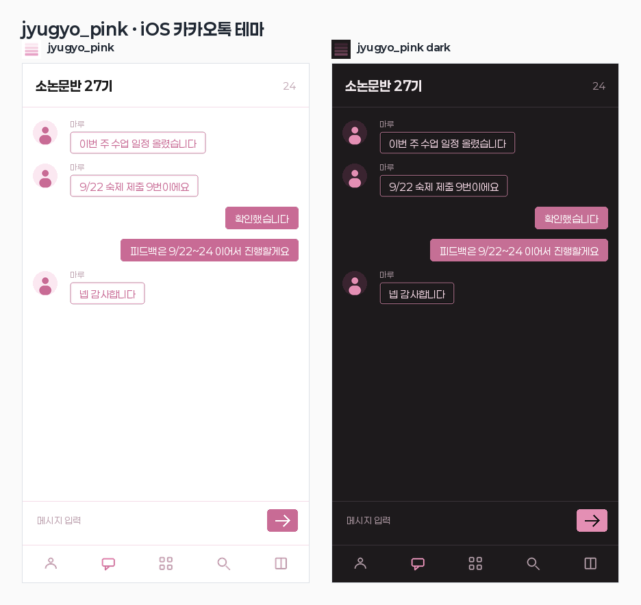

# jyugyo_pink — iOS 카카오톡 테마

말풍선과 글자색은 참고 스크린샷에서 직접 뽑았고, 화면 구조는 TIS 교사 페이지
대시보드를 따른다. 밝은 쪽 `jyugyo_pink` 와 어두운 쪽 `jyugyo_pink dark` 두 벌.



## 받아서 쓰기

`dist/` 안의 `.ktheme` 파일 하나를 아이폰으로 보낸다(에어드롭·카톡 나에게 보내기·메일 첨부 등).

1. 아이폰에서 파일을 연다
2. 공유 시트 → **카카오톡**
3. 카카오톡이 테마를 설치한다
4. 더보기 → 설정 → 테마 → 방금 설치한 테마 선택

지우려면 같은 화면에서 테마를 길게 눌러 삭제한다.

## 색

| 자리 | jyugyo_pink | dark | 출처 |
|---|---|---|---|
| 목록·채팅방·입력바 배경 | `#FFFFFF` | `#1D1A1C` | 스크린샷 흰 바탕 |
| 눌린 줄 | `#FCEDF3` | `#2A2429` | 스크린샷 별무늬 분홍 |
| 구분선 | `#F5DCE8` | `#3A3238` | — |
| 제목·이름 글자 | `#191919` | `#F3ECEF` | 스크린샷 헤더 |
| 보조 글자 | `#BEA3B0` | `#A8949E` | 스크린샷 입력창 안내문 |
| 포인트(전송 버튼·안 읽은 수·선택된 탭) | `#C86B95` | `#E48FB4` | 스크린샷 말풍선 글자 |
| 보낸 말풍선 | `#C86B95` 단색 | `#C56F95` 단색 | 스크린샷 테두리색으로 안까지 |
| 보낸 말풍선 글자 | `#FFFFFF` | `#FFFFFF` | — |
| 받은 말풍선 | `#FFFFFF` + `#C86B95` 테두리 | `#1D1A1C` + `#E48FB4` 테두리 | 스크린샷 |
| 받은 말풍선 글자 | `#C86B95` | `#F6D9E6` | 스크린샷 |

말풍선 모서리는 4pt. 색만 스크린샷을 따르고 모양은 각진 쪽으로 둔다.
선택 안 된 탭 아이콘만 보조글색보다 한 톤 진한 `#B792A3` 을 쓴다 —
`#BEA3B0` 은 흰 바탕에서 아이콘으로 쓰기엔 너무 흐리다.

기본 프로필 3장과 잠금화면 동그라미 4자리는 같은 분홍 계열을 단계별로 나눠 쓴다.

그림자·그라데이션·일러스트는 쓰지 않는다. 평평한 단색 말풍선이다.

## 고치기

색은 `build.py` 의 `PALETTES` 한 군데에만 있다.

```
python3 kakaotalk-theme/build.py     # 이미지 63장 + CSS 를 만들고 .ktheme 으로 포장
python3 kakaotalk-theme/preview.py   # assets/preview.png 다시 그리기
```

`build-src/` 는 생성물이라 저장소에 넣지 않는다. 결과는 `dist/*.ktheme`.

## 아는 제약

- **글꼴은 못 바꾼다.** iOS 테마 규격에 글꼴 속성이 없어서 Paperlogy 는 적용되지 않는다.
  저장소의 Paperlogy 는 미리보기 그림을 그리는 데만 쓴다.
- **라이트/다크 자동 전환이 없다.** 카카오톡 테마는 한 벌이 고정이라 두 파일을 따로 넣고
  손으로 바꿔 끼워야 한다.
- **배경 별무늬는 넣지 않았다.** 스크린샷의 별 패턴은 배경 이미지(`mainBgImage` /
  `chatroomBgImage`)로 넣을 수 있다. 말풍선·글자색만 맞춰 달라는 요청이라 비워 뒀다.
- **앱 아이콘과 설정 화면은 못 바꾼다.** 공식 테마 전용이거나 규격에 블록이 없다.
- 규격 기준은 카카오톡 9.2.5 문서다. 카톡 버전이 올라가 속성이 늘면 다시 맞춰야 한다.
- `assets/preview.png` 는 흉내 낸 그림이지 실제 앱 렌더링이 아니다. 최종 확인은 기기에서.

## 파일

```
build.py            팔레트 → 이미지·CSS·.ktheme  (색은 여기 한 곳)
preview.py          미리보기 그림
assets/preview.png  라이트·다크 나란히
assets/fonts/       Paperlogy (OFL) — 미리보기 전용
dist/jyugyo_pink.ktheme       밝은 쪽
dist/jyugyo_pink_dark.ktheme  어두운 쪽
```

## 안드로이드는?

안드로이드 테마는 APK 라서 구조가 전혀 다르다(리소스만 든 APK, `res/values/colors.xml` +
9-patch 이미지, 서명 필요). 필요하면 같은 팔레트로 따로 만들면 된다.
